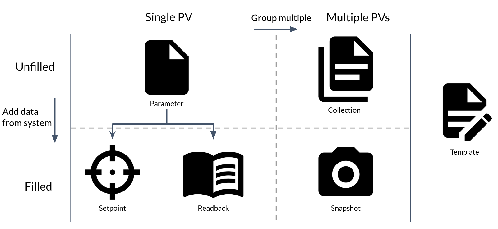

Data Model
==========

The data model is central to the operation of superscore.  Data is stored in one
of six main dataclasses.  These dataclasses can be split into two main categories:

- Unfilled: Simply specifying the PVs to record
- Filled: Holding PV-Data pairs, with data values being pulled from the EPICS controls system

The relationships between these dataclasses are summarized in Figure 1:

Parameter |PARAMETER|
---------------------
The `Parameter` is the building block of configurations in Superscore, holding
an EPICS PV.  Parameters can become either a `Setpoint` or `Readback` when
filled with data from the controls system.

Setpoint |SETPOINT|
-------------------
A `Setpoint` is a recorded value that **can** be written back to the system.
Setpoints can have an associated Readback.

Readback |READBACK|
-------------------
A `Readback` is a recorded value that **cannot** be written back to the system.
`Readback` 's are meant to only store information from the system and to be used
for comparison.  In cases where setting the value of a PV might affect the value
of a different PV, which might not necessarily match the setpoint value.
For example, if moving the position of a motor is expected to directly affect the value
of a related diode reading, one might set the motor's position in a `Setpoint`
and the diode's voltage in a `Readback`

Collection |COLLECTION|
-----------------------
A `Collection` is a grouping of `Parameter` and `Collection` entries.  By also
allowing `Collection` 's to hold other `Collection` 's, we enable building
configurations in an organized and hierarchical manner.  When filled with data
from the controls system, a `Collection` will become a `Snapshot` with matching
internal structure.

Snapshot |SNAPSHOT|
-------------------
A `Snapshot` is a filled `Collection`, comprised of `Setpoint`, `Readback`, and
other `Snapshot` Entries.  A Snapshot will mimic the structure of the `Collection`
it was created from, as well as retain a link to that originating `Collection`.
This ensures that users can recreate `Snapshot`s and understand the context of
its origin.

